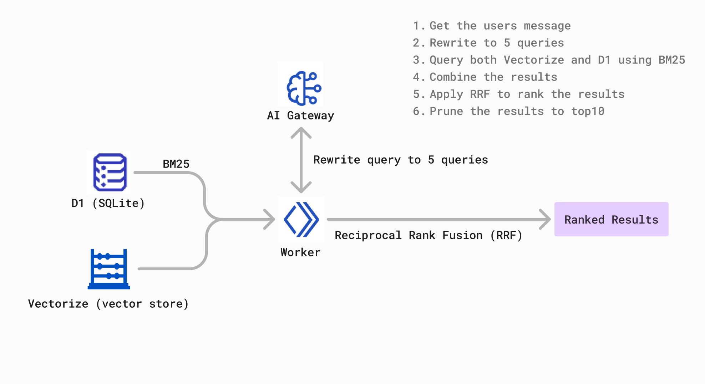

# Chat with PDF 🗣️💬📄

Chat with PDF is a full-stack AI-powered application that lets you to ask questions to PDF documents.

The application is running with server-side rendering on the edge using Cloudflare Pages.

You can deploy it with zero configuration on your Cloudflare account using NuxtHub:

[](https://hub.nuxt.com/new?template=chat-with-pdf)

### 🚀 Key Features

- **Hybrid RAG**: Hybrid RAG using Full-Text Search on D1 and Vector Search on Vectorize
- **Streamed Responses**: Information is streamed real-time to the UI using Server-Sent Events
- **High-Performance**: Deployed on the edge with server-side rendering using Cloudflare Pages

<!-- ### 🎥 See It in Action

https://github.com/Atinux/atidraw/assets/904724/85f79def-f633-40b7-97c2-3a8579e65af1

Ready to create? Visit [chat-with-pdf.nuxt.dev](https://chat-with-pdf.nuxt.dev) and share your best drawing! -->

## 🛠 Tech Stack

- [Nuxt](https://nuxt.com) - The Intuitive Vue Framework
- [Nuxt UI](https://github.com/nuxt/ui) - Beautiful UI library with TailwindCSS
- [Drizzle ORM](https://orm.drizzle.team/) - Powerful modern TypeScript ORM
- [unpdf](https://github.com/unjs/unpdf) - Platform-agnostic version of [PDF.js](https://github.com/mozilla/pdf.js) for serverless environments
- [NuxtHub Rate Limit](https://github.com/fayazara/nuxthub-ratelimit) - Ratelimiting requests
- [NuxtHub](https://hub.nuxt.com) - Build & deploy to your Cloudflare account with zero configuration
  - [`hubBlob()`](https://hub.nuxt.com/docs/features/blob) to store PDFs in Cloudflare R2
  - [`hubDatabase()`](https://hub.nuxt.com/docs/features/blob) to store document chunks and full-text search on Cloudflare D1
  - [`hubAI()`](https://hub.nuxt.com/docs/features/ai) to run Cloudflare AI models for LLM chat and generating text embeddings
  - [`hubVectorize()`](https://hub.nuxt.com/docs/features/ai) to find relevant document context in Cloudflare Vectorize
  - [`hubKV()`](https://hub.nuxt.com/docs/features/ai) for IP ratelimiting
- [`npx nuxthub deploy`](https://github.com/nuxt-hub/cli) - To deploy the app on your Cloudflare account for free

## 🏎️ How does it work?



This project uses a combination of classical Full Text Search (sparse) against Cloudflare D1 and Hybrid Search with embeddings against Vectorize (dense) to provide the best of both worlds providing the most applicable context to the LLM.

The way it works is this:

1. We take user input and we rewrite it to 5 different queries using an LLM
2. We run each of these queries against our both datastores - D1 database using BM25 for full-text search and Vectorize for dense retrieval
3. We take the results from both datastores and we merge them together using [Reciprocal Rank Fusion](https://www.elastic.co/guide/en/elasticsearch/reference/current/rrf.html) which provides us with a single list of results
4. We then take the top 10 results from this list and we pass them to the LLM to generate a response

<sub>Credits: https://github.com/RafalWilinski/cloudflare-rag#hybrid-search-rag</sub>

## 🚀 Quick Start

1. Install dependencies with [pnpm](https://pnpm.io)
    ```bash
    pnpm install
    ```
2. Create & link a NuxtHub project to enable running AI models on your Cloudflare account
    ```bash
    npx nuxthub link
    ```
4. Deploy the application to your Cloudflare account
    ```bash
    npx nuxthub deploy
    ```
4. Launch the dev server
    ```bash
    pnpm dev --remote
    ```

Visit `http://localhost:3000` and start chatting with documents!

## 🌐 Deploy to the World for Free

Host your Chat with PDF instance on a **free Cloudflare account** and **free NuxtHub account**.

Deploy it online in the NuxtHub UI:

[](https://hub.nuxt.com/new?repo=RihanArfan/chat-with-pdf)

Or locally with the [NuxtHub CLI](https://github.com/nuxt-hub/cli):

```bash
npx nuxthub deploy
```

This command will deploy your Chat with PDF instance to your Cloudflare account and provision a Cloudflare R2 bucket. You will also get a free `<your-app>.nuxt.dev` domain.

What's included in Cloudflare free plan:
- 100,000 requests/day
- 10 GB storage on Cloudflare R2
- 10,000 tokens a day for Workers AI
- 30 million queried vector dimensions / month
- 5 million stored vector dimensions

Read more about the pricing on our [detailed pricing page](https://hub.nuxt.com/pricing).

You can also deploy using [Cloudflare Pages CI](https://hub.nuxt.com/docs/getting-started/deploy#cloudflare-pages-ci) or [GitHub actions](https://hub.nuxt.com/docs/getting-started/deploy#github-action).

### Remote Storage

Once your project is deployed, you can use [NuxtHub Remote Storage](https://hub.nuxt.com/docs/getting-started/remote-storage) to connect to your preview or production Cloudflare R2 bucket in development using the `--remote` flag:

```bash
pnpm dev --remote
```

## 🔗 Useful Links

- [Live Demo](https://chat-with-pdf.nuxt.dev)
- [NuxtHub Documentation](https://hub.nuxt.com)
- [Nuxt UI](https://ui.nuxt.com)
- [Nuxt](https://nuxt.com)

## 📝 License

Published under the [MIT license](./LICENSE).

## 🙋 Credits

- [cloudflare-rag](https://github.com/RafalWilinski/cloudflare-rag) by [Rafal Wilinski](https://github.com/RafalWilinski) - Chat with PDF is a port of the cloudflare-rag project to NuxtHub and Nuxt UI. The core logic and functionality are derived from cloudflare-rag, adapted to work with NuxtHub.
- [hub-chat](https://github.com/ra-jeev/hub-chat) by [Rajeev R Sharma](https://github.com/ra-jeev) - Parts of UI and inspiration for the streaming composable.
